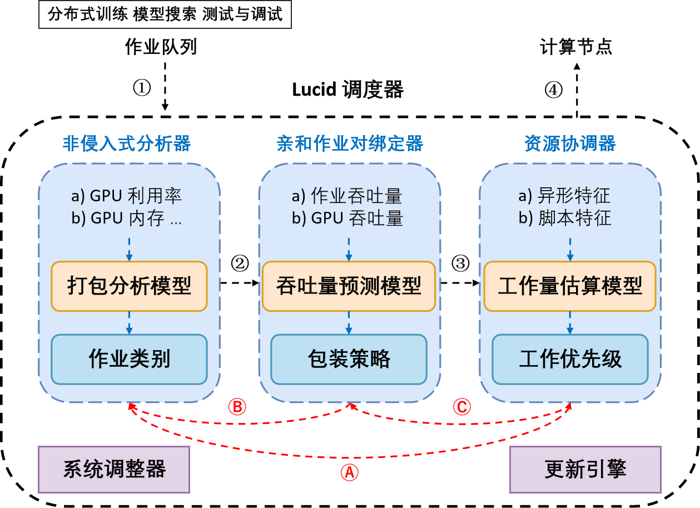

# 2024Fall SYSU CSE 高级计算机体系结构课程作业
本仓库复现 ASPLOS '23 论文：

**Lucid: A Non-intrusive, Scalable and Interpretable Scheduler for Deep Learning Training Jobs**

原文仓库链接：https://github.com/S-Lab-System-Group/Lucid

# Lucid系统架构

# 代码框架说明
## GPU 集群建模 /simulation

* **`cluster.py`**：用于模拟整个 GPU 集群的资源分配和管理。它定义了节点、GPU 设备以及每个设备的资源容量等关键属性。
* **`job.py`**：用于模拟在 GPU 集群中运行的训练任务（Job），包括任务的资源需求、任务时长、任务队列状态等。
* **`updater.py`**：负责动态更新集群的状态，比如任务的完成、资源的释放等。
* **`simulator.py`**：仿真的主要入口，用于初始化集群和任务，加载配置文件并执行模拟。

## 模拟数据 /simulation/data
* **`data`** 文件夹提供了 **Venus 集群**的任务轨迹和配置文件，包括任务类型、提交时间、资源需求等。

## 工作负载 /workloads

* **`workloads`** 文件夹提供了 14 种不同的深度学习工作负载的实现，使用 PyTorch 定义。每种工作负载可能对应不同的资源需求和执行特性，例如 GPU 使用率、训练时间等。

## 调度算法 /simulation/policy

policy中包括：
* Lucid 的调度策略
* 其他baseline policy：FIFO（先到先服务）、SJF（短任务优先）、QSSF、Tiresias 等
    
调度策略通过模拟任务在集群中的执行，分析任务排队时间（Queuing Delay）、任务完成时间（Job Completion Time, JCT）等关键性能指标。

## Model 1：打包分析模型 /simulation/analyzer

包含 Packing Analyze Model，分析哪些作业应打包一起执行。

## Model 2：吞吐量预测模型 /simulation/predictor

包含 Throughput Predict Model，用于预测不同任务类型在 GPU 集群中的吞吐量。

包括 **RF LightGBM XGBoost DNN**四个baseline模型与**Lucid**的对比。

## Model 3：工作量估计模型 /simulation/estimator

包含 Workload Estimate Model，预测任务的时长等性能特性。

# 结果可视化

1. `predictor.ipynb`
   * **Table 6**：吞吐量预测模型（Lucid 与 baseline）性能对比 (MAE Scores)。
   * **Figure 5**：吞吐量预测表现。
   * **Figure 2 (a)(b)**：模型解释和学习到的形函数。
2. `result_plot.ipynb`
    * **Table 1**：调度性能对比 (Average JCT, Average Queuing Delay 等)。
    * **Table 2**：不同规模工作负载的调度性能。
    * **Figure 4**：作业完成时间 (JCT) 的累积分布图 (CDF)。
    * **Figure 5**：每个 VC 中使用不同调度方法的平均作业排队延迟。
3. `myres.ipynb`
    * **Figure 6 7 8**：依次对打包模型、预测模型、估计模型消融实验作业完成时间（JCT）时长。
